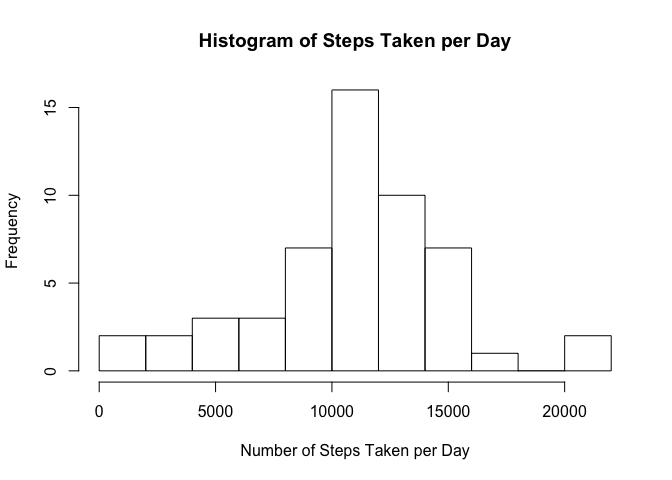
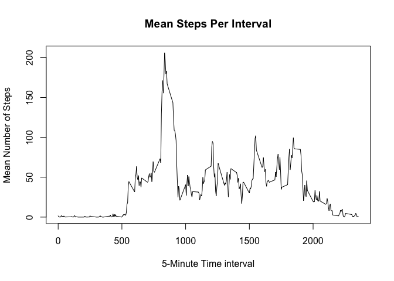
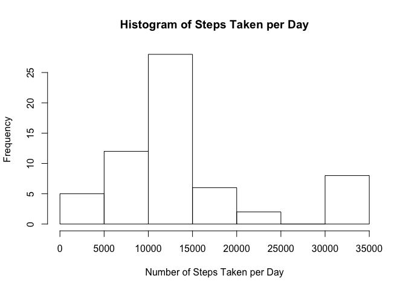
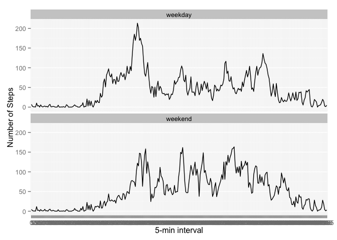

# RR-assignment1
James Lowry  
5 March 2016  
 
### Read in the raw data

```r
activity <- read.csv("./data/activity.csv")
```

### What is the mean total number of steps taken per day?

1. Calculate the total number of steps taken per day


```r
stepsperday <- tapply(activity$steps, activity$date, sum)
```
2. Make a histogram of the total number of steps taken each day

```r
hist(stepsperday, main = "Histogram of Steps Taken per Day", xlab = "Number of Steps Taken per Day", breaks = 10)
```



3. Calculate and report the mean and median of the total number of steps taken per day


```r
meanstepsperday <- mean(stepsperday, na.rm = TRUE)
medianstepsperday <- median(stepsperday, na.rm = TRUE)
```

**The mean number of steps taken per day is 1.0766189\times 10^{4} .**

**The median number of steps taken per day is 10765 .**

### What is the average daily activity pattern ?

1. Make a time series plot (i.e. 𝚝𝚢𝚙𝚎 = "𝚕") of the 5-minute interval (x-axis) and the average number of steps taken, averaged across all days (y-axis) 


```r
# filter out null step values from activity
completeactivity <- activity[complete.cases(activity),]
#now get mean number of steps for interval
meanintsteps <- tapply(completeactivity$steps, as.factor(completeactivity$interval), mean)
plot(names(meanintsteps),meanintsteps, type='l', xlab = "5-Minute Time interval", ylab="Mean Number of Steps", main = "Mean Steps Per Interval")
```



2.  Which 5-minute interval, on average across all the days in the dataset, contains the maximum number of steps?


```r
maxint <- names(which.max(meanintsteps))
```

**The answer is 835**

### Imputing missing values
1.	Calculate and report the total number of missing values in the dataset (i.e. the total number of rows with 𝙽𝙰(s)

```r
#Already have the dataframe 'activity' that includes the NAs 
#and another dataframe 'completeactivity' with the NAs removed
#So number of rows with NAs is simply
numna <- nrow(activity) - nrow(completeactivity)
```

**The total number of rows with NAs is 2304**

2.	Devise a strategy for filling in all of the missing values in the dataset. The strategy does not need to be sophisticated. For example, you could use the mean/median for that day, or the mean for that 5-minute interval, etc.

    **Stragey**:replace the NAs with the mean for that 5-minute interval

3.	Create a new dataset that is equal to the original dataset but with the missing data filled in.


```r
#create dataframe, df, that has the mean steps per interval
df <- cbind(meanintsteps, names(meanintsteps))
# get the subset of activity data with NA values
nostep<-subset(activity, is.na(activity$steps))
#merge these two new dataframes by interval
#i.e. map the mean steps per int to the corresponding interval
df2<-merge(nostep, df, by.x="interval", by.y="V2")
#modify df2 so we can bind it to the dataframe completeactivity
df2$steps<-as.integer(df2$meanintsteps)
df2<-subset(df2, select=c("steps", "date", "interval"))
#Create dataframe called filledactivity that is equal to the 
#original dataset but with the missing data filled in
filledactivity <- rbind(df2, completeactivity)
```

4.	Make a histogram of the total number of steps taken each day and Calculate and report the mean and median total number of steps taken per day.  


```r
fstepsperday <- tapply(filledactivity$steps, filledactivity$date, sum)
hist(fstepsperday, main = "Histogram of Steps Taken per Day", xlab = "Number of Steps Taken per Day", breaks = 10)
```




```r
fmeanstepsperday <- mean(fstepsperday)
fmedianstepsperday <- median(fstepsperday)
```


**The new mean number of steps taken per day is 1.3665443\times 10^{4} .**

**The previous mean number of steps taken per day is 1.0766189\times 10^{4} .**

**The new median number of steps taken per day is 11458 .**

**The previous median number of steps taken per day is 10765 .**

Do these values differ from the estimates from the first part of the assignment?  What is the impact of imputing missing data on the estimates of the total daily number of steps?

**The new mean and median values, i.e. the ones computed with the NAs replaced by the mean number of steps per interval, are higher than the estimates from the first part of the assignment which simply ignored the NAs.**

### Are there differences in activity patterns between weekdays and weekends?
For this part the *𝚠𝚎𝚎𝚔𝚍𝚊𝚢𝚜()* function may be of some help here. Use the dataset with the filled-in missing values for this part.

	1.	Create a new factor variable in the dataset with two levels – “weekday” and “weekend” indicating whether a given date is a weekday or weekend day.


```r
#load dplyr package
library(dplyr)
```

```
## 
## Attaching package: 'dplyr'
```

```
## The following objects are masked from 'package:stats':
## 
##     filter, lag
```

```
## The following objects are masked from 'package:base':
## 
##     intersect, setdiff, setequal, union
```

```r
filledactivity <- mutate(filledactivity, daytype=weekdays(as.Date(filledactivity$date)) %in% c("Saturday", "Sunday"))
filledactivity$daytype<-as.factor(filledactivity$daytype)
filledactivity$interval<-as.factor(filledactivity$interval)
levels(filledactivity$daytype) <- c("weekday", "weekend")
```


	2.	Make a panel plot containing a time series plot (i.e. 𝚝𝚢𝚙𝚎 = "𝚕"() of the 5-minute interval (x-axis) and the average number of steps taken, averaged across all weekday days or weekend days (y-axis). See the README file in the GitHub repository to see an example of what this plot should look like using simulated data.
	


```r
fdg <- group_by(filledactivity, interval, daytype)
final<-summarise(fdg, msi=mean(steps))
library(ggplot2)
fp <- ggplot(final, aes(interval, msi, group=1)) + geom_line() 
fp <- fp +  labs(x="5-min interval", y="Number of Steps")
fp <-fp + facet_wrap(~daytype, nrow=2)
fp
```


